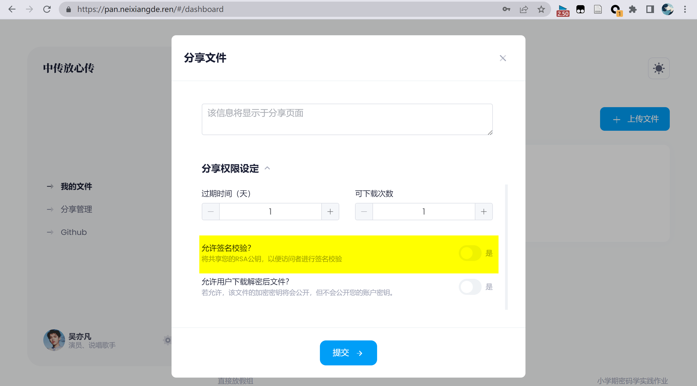
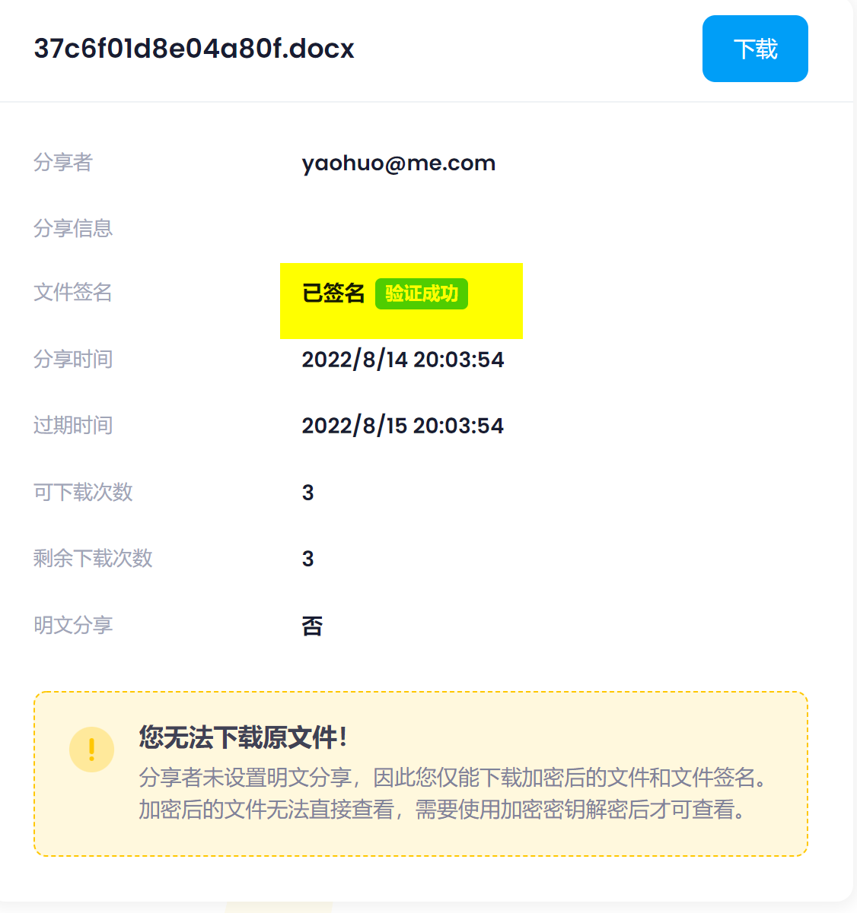

## 贡献与工作

主要完成了文件签名和验证签名的工作，也包括了验证完整性的部分。

在我们的系统当中，文件签名指的是用户在分享的时候对即将进行分享的文件进行签名。验证签名指的是其他用户在下载他人分享的文件时可以通过对于签名的验证来确定文件是否属于分享者，同时也可判断文件是否被篡改。

原本的系统设计当中使用的全部是对称加密，因为对称加密的速度比较快，同时适合加密文件。但是文件签名和验证的部分无法仅仅通过对称密钥来完成。这是因为签名的过程涉及到签名方和验证方，如果双方都使用同一把密钥进行签名和验证，这样就会导致不安全性。也就是有密钥的任意一方都可以进行签名的操作，这样就无法保证签名的真实性和可靠性。因此需要使用非对称加密，也就是用户持有自己的私钥，他人通过公开的公钥进行验证。

本系统当中使用的是RSA非对称加密算法，主要包括以下步骤：


主要使用RSA密钥对，包括以下几个步骤。

### RSA密钥对生成

1. 生成：在用户注册时生成。使用浏览器crypto库生成。
    - 公钥：明文传输和存储。
    - 私钥：使用主密钥加密后传输和存储。


```typescript
  [Actions.GEN_RSA_PAIR]() 
    {
    function RSA2text(buffer, isPrivate = 0) {
      let binary = "";
      const bytes = new Uint8Array(buffer);
      const len = bytes.byteLength;
      for (let i = 0; i < len; i++) {
        binary += String.fromCharCode(bytes[i]);
      }
      const base64 = window.btoa(binary);
      let text =
        "-----BEGIN " + (isPrivate ? "PRIVATE" : "PUBLIC") + " KEY-----\n";
      text += base64
        // eslint-disable-next-line no-control-regex
        .replace(/[^\x00-\xff]/g, "$&\x01")
        // eslint-disable-next-line no-control-regex
        .replace(/.{64}\x01?/g, "$&\n");
      text += "\n-----END " + (isPrivate ? "PRIVATE" : "PUBLIC") + " KEY-----";
      return text;
    }

    window.crypto.subtle
      .generateKey(
        {
          name: "RSA-OAEP",
          modulusLength: 4096, //can be 1024, 2048, or 4096
          publicExponent: new Uint8Array([0x01, 0x00, 0x01]),
          hash: { name: "SHA-512" }, //can be "SHA-1", "SHA-256", "SHA-384", or "SHA-512"
        },
        true, //whether the key is extractable (i.e. can be used in exportKey)
        ["encrypt", "decrypt"] //must be ["encrypt", "decrypt"] or ["wrapKey", "unwrapKey"]
      )
      .then((key) => {
        if (key.privateKey) {
          window.crypto.subtle
            .exportKey("pkcs8", key.privateKey)
            .then((keydata1) => {
              if (key.publicKey) {
                window.crypto.subtle
                  .exportKey("spki", key.publicKey)
                  .then((keydata2) => {
                    const privateKey = RSA2text(keydata1, 1);
                    const publicKey = RSA2text(keydata2);
                    this.context.commit(Mutations.SET_RSA_KEY, {
                      public_key: publicKey,
                      private_key: privateKey,
                    });
                  })
                  .catch(function (err) {
                    console.error(err);
                  });
              }
            })
            .catch(function (err) {
              console.error(err);
            });
        }
      })
      .catch(function (err) {
        console.error(err);
      });

  }

```

### 分享者签名

2. 签名：在用户分享文件时。
    - 发起分享→下载加密后文件→取哈希值→下载加密后私钥→使用主密钥解密私钥→使用私钥加密哈希值（签名）




```typescript
          // 创建 Signature 对象
          let signature = new jsrsasign.KJUR.crypto.Signature({
            alg: "SHA1withRSA",
          });
          // 传入key实例, 初始化signature实例
          signature.init(jsrsasign.KEYUTIL.getKey(rsa_private_key.value));
          // 传入待签明文
          signature.updateString(file_content);
          // 签名, 得到16进制字符结果
          let sign = jsrsasign.hextob64(signature.sign());
```

### 下载者验证

3. 验签：在用户下载他人分享文件时。
    - 下载加密后文件→下载分享者公钥→使用公钥解密（验签）→显示验证状态→解密文件





```typescript
        let signatureVf = new jsrsasign.KJUR.crypto.Signature({
          alg: "SHA1withRSA",
        });
        signatureVf.init(
          jsrsasign.KEYUTIL.getKey(fileInfo.value.rsa_public_key)
        );
        signatureVf.updateString(file_content);
        // !接受的参数是16进制字符串!
        rsa_signed.value = signatureVf.verify(
          jsrsasign.b64tohex(fileInfo.value.signature)
        );
```


### 完整性验证

这一部分其实在签名和验证签名的部分就已经完成了。因为签名的本质是对于文件散列值的私钥加密，验证签名的本质是对于公钥解密后的文件散列值的比对。因此在这个过程中，如果传输出现了错误，导致文件损坏，那么文件的散列值也将会改变，无法通过验证。


## BUG & SOLUTION

| BUG                                                     | SOLUTION                                                                            |
|---------------------------------------------------------|-------------------------------------------------------------------------------------|
| 前端使用ctypto库生成的RSA密钥对为字节数组格式，不方便传输存储,同时服务器端在使用的时候难以进行导入。 | 实现`RSA2text`函数，将生成后的密钥对转换为pem格式传输和存储                                                |
| 散列值密文过长，需要分组进行加密                                        | 将RSA密钥长度设为4096                                                                      |
| 用户可能绕过前端的注册过程直接向后端发送数据，这样后端存储的rsa密钥对可能并不是生成的，而是用户伪造的。   | 用户在登录的时候使用的是JWT，这时使用数据库当中存储的公钥对于TOKEN加密，用户只有持有私钥并且公司要对有效才能解密出TOKRN。否则无法完成登录也无法上传文件。 |
| 使用JSEncrypt库无法公钥加密                                      | 一般加密指的就是私钥加密，公钥解密，签名需要换用签名库jsrsasign                                                |
