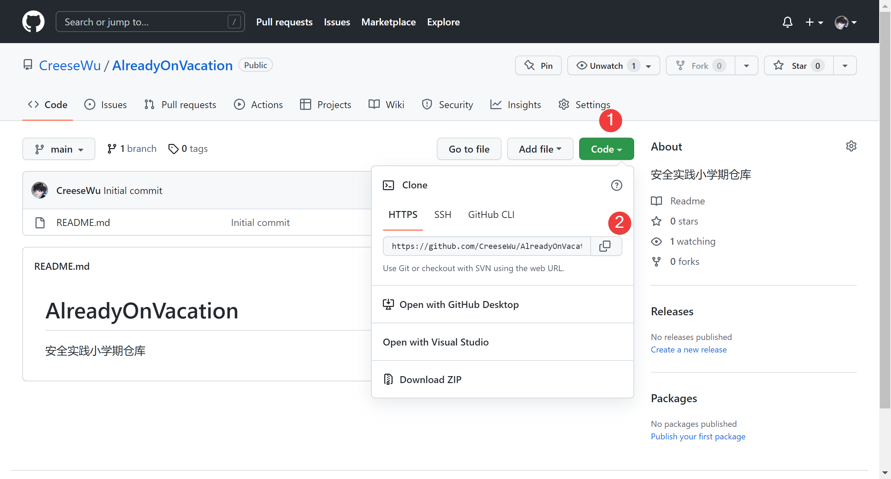
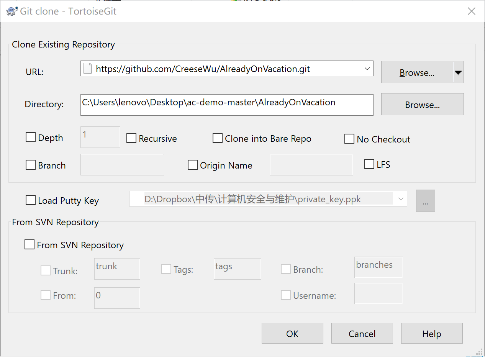

最简单能工作就好，可能这个方法不太正规，但是没关系。

假设你现在要在主分支加一个功能，顺序是：

# 复制咱们仓库的地址

# 用王八克隆下来

就是要找一个没有这个目录的目录，右键克隆下来。

这里克隆的是主分支哈，所以上面的`Branch`不用勾也不用写，因为默认就是主分支。

# 改

在克隆下来的文件里改

# 上传

在克隆下来的根目录下右键，找到乌龟，先`commit`。这里你`commit`到哪个分支都行，因为都是你电脑上的分支。

然后`commit`完王八会让你`push`，注意这时候要`push`到一个新的分支，因为这里已经是远程分支了，看图。

