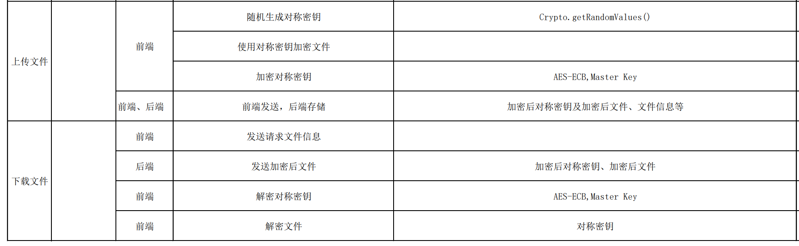

# 「中传放心传」总结技术报告
小组成员：汪莹华
主要负责部分：文件上传和下载
时间：2022.7月-8月
## 实现的技术
我完成的内容是文件的上传和下载，大致工作如下图，下面会展开详细描述

## 完成情况
- [X] 基于网页的文件上传加密与数字签名系统
  - [X] 限制文件大小：小于 10MB
  - [X] 限制文件类型：office文档、常见图片类型
  - [X] 匿名用户禁止上传文件
  - [X] 对文件进行对称加密存储到文件系统，禁止明文存储文件 【 对称加密 密钥管理（如何安全存储对称加密密钥） 对称加密密文的PADDING问题 】
- [X] 基于网页的加密文件下载与解密
  - [X] 提供匿名用户加密后文件和关联的数字签名文件的下载
  - [X] 客户端对下载后的文件可以解密还原到原始文件 【 对称解密 密钥管理 】
  - [X] 提供已登录用户解密后文件下载
## 个人主要贡献
### 1.利用对称密钥加密文件
```
        // 随机生成加密密钥
         let file_key = Array.from(crypto.getRandomValues(new Uint8Array(16)))
          .map((x) => x.toString(16))
          .join("");
        file_key = Cryptojs.MD5(file_key).toString();
        console.log("对称密钥：" + file_key);

        // 加密文件
        if (typeof this.result === "string") {
          //去除base64,剩下的就是文件内容
          const file_content_base64 = this.result.split("base64,")[1];

          var srcs = Cryptojs.enc.Utf8.parse(file_content_base64);
          var encrypted = Cryptojs.AES.encrypt(
            srcs,
            Cryptojs.enc.Utf8.parse(file_key),
            {
              mode: Cryptojs.mode.ECB,
              padding: Cryptojs.pad.Pkcs7,
            }
          ).toString();
```
为了实现文件上传，我们随机生成了对称密钥对文件进行加密后上传。
### 2.文件的上传和存储
```
@app.route('/api/upload', methods=['POST'])
@jwt_required()
def upload():
    raw = request.data
    json_data = json.loads(raw)
    encrypted = json_data['encrypted']
    file_enc_key = json_data['file_key']
    name = json_data['name']
    type = json_data['type']
    # file_sha256 = json_data['file_sha256']
    size_mb = len(encrypted) / 1024 / 1024

    # 判断encrypted大小是否大于15M
    if (size_mb > 15):
        return json.dumps({"errors": [{"file": "文件过大"}]}), 500

    # 存储至数据库
    try:
        uuid = str(uuid4())
        file = File(name=name, type=type, size_mb=size_mb,
                    uuid=uuid, user=get_jwt_identity())
        db.session.add(file)
        file_content = FileContent(uuid=uuid, content=encrypted, file_enc_key=file_enc_key)
        db.session.add(file_content)
        db.session.commit()
    except Exception as e:
        return json.dumps({"errors": [{"db": ["数据库错误", str(e)]}]}), 500

    return "上传成功"
```
判断文件大小，将其上传同时存至数据库中。
### 3.发送加密后文件
```
@app.route('/api/download', methods=['POST'])
@jwt_required()
def download():
    json_data = json.loads(request.data)
    file_id = json_data['id']

    # 判断文件是否存在
    file = File.query.filter_by(file_id=file_id).first()
    if not file:
        return json.dumps({'errors': {file: ["文件不存在"]}}), 500

    # 判断文件是否属于该用户
    if file.user != get_jwt_identity():
        return json.dumps({'errors': {file: ["无下载权限"]}}), 500

    # 获取文件内容
    file_content = FileContent.query.filter_by(uuid=file.uuid).first()
    return json.dumps(file_content.to_json())
```
根据不同用户状态提供下载内容。
### 4.解密对称密钥与文件
```
        //解密对称密钥
        console.log(key);
        key = Cryptojs.AES.decrypt(
          key,
          Cryptojs.enc.Utf8.parse(store.state.AuthModule.user.master_key),
          {
            mode: Cryptojs.mode.ECB,
            padding: Cryptojs.pad.Pkcs7,
          }
        ).toString(Cryptojs.enc.Utf8);
        console.log("解密后的对称密钥：" + key);

        //开始解密文件内容
        console.log("开始解密文件内容");

        var decrypt = Cryptojs.AES.decrypt(
          file_content,
          Cryptojs.enc.Utf8.parse(key),
          {
            mode: Cryptojs.mode.ECB,
            padding: Cryptojs.pad.Pkcs7,
          }
        );
        file_content = decrypt.toString(Cryptojs.enc.Utf8);
        console.log("解密后的文件内容：" + file_content);
```
为了保证对称密钥的安全，我们利用了注册账户时生成的Master Key，对对称加密密钥进行加密后存入数据库之中，所以提取时需先用Master Key进行解密，解密出对称密钥后再解密文件。
## 自认为完成的有技术含量的工作
 - 文件上传和下载的功能
 - 文件加解密（含对称密钥的生成）
 - 存储文件信息的数据库
 - 根据不同用户状态提供下载内容
## 印象深刻的一些 bug 和解决方法
- 印象深刻的首先就是有关**数据库的学习**:因为要考虑到存储加密后的密钥和加密文件的格式及大小问题[Python 操作 MySQL 数据库](https://www.runoob.com/python/python-mysql.html)
- 文件上传下载运用到json的一些报错及解决方法：
[python使用json时各种报错问题](https://blog.csdn.net/baidu_30374343/article/details/84838269)
[Python报错：json格式错误](https://blog.csdn.net/dddxxy/article/details/119385681)
- 使用crypto库前后端加密结果不一致：改用[CryptoJS库](https://blog.csdn.net/qq_40140218/article/details/86032802)
## 总结
通过这次小学期的实践作业使得我对于前端和后端的编写能力都得到了一个提升，同时对于一个云盘的架构更加的了解。此外，从密码学的角度来看，我加强了对于密码学应用的实践，完善了对于文件上传和下载中加解密流程的逻辑设计与实现。非常重要的是感谢组员的一起努力和帮助。