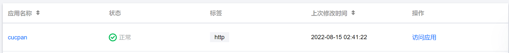
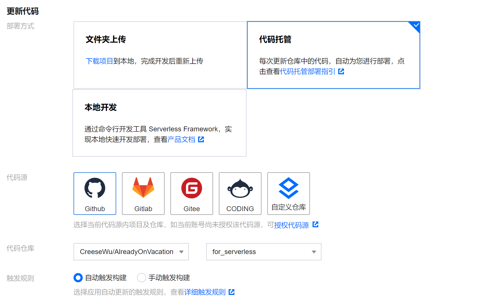
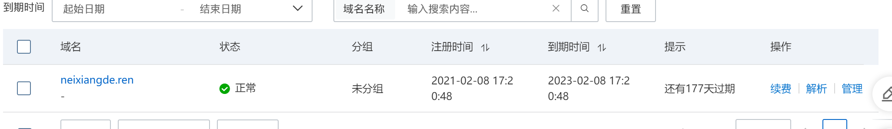
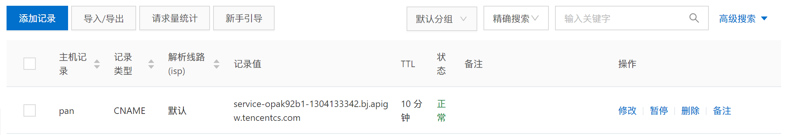
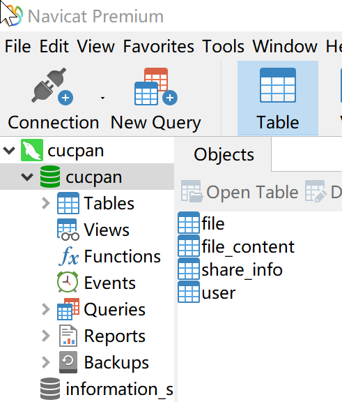

在本次的实践作业当中，我主要完成了前后端连接、数据库搭建、服务器部署等工作。

## 服务器搭建

本次实践当中我们选用的是腾讯云的SERVERLESS服务器，主要有以下几个优点。

1. 可以通过GITHUB进行自动部署。
2. 可以直接绑定域名。
3. 可以方便接入腾讯云的自签发HTTPS证书。

首先进入腾讯云的网站，申请一个SERVERLESS服务器。




随后选择更新服务的方式，选择GITHUB，同时选择我们的小组作业仓库。这样当我们的成员对代码进行改动，并且推送到仓库里面的主分支的时候，腾讯云的后台就可以获知到更新的状况，并且自动将最新的代码部署到服务器上。





## 域名绑定

本次的小组作业，我们组的域名是`pan.neixiangde.ren`。这个域名是在阿里云注册的，因此无法使用腾讯云内嵌的服务，一键绑定到腾讯云的服务器当中。




首先我们需要在腾讯云当中添加这个域名，并且获取到对应CNAME。

随后需要在阿里云的面板当中进行域名的解析。




## 前后端连接

前端使用的是VUE，后端使用的是FLASK。

他们没有办法像PHP一样直接写在同一个文件里面进行处理。

因此需要将静态的文件在FLASK当中进行注册，保证用户在访问VUE编译出来的静态文件的时候，FLASK能够返回对应的文件，而不是使用PYTHON的代码进行处理。

同时也要保证 URL 的层级关系是对应的，否则会出现404的情况。

在`app.py`当中添加如下代码：

```python
app = Flask(__name__, static_folder='dist', static_url_path='/')
```


## 数据库搭建


首先在腾讯云当中申请一个数据库，获取到外网的访问地址和数据库的账号密码。


随后使用Navicat的数据库管理软件进行数据库表的建立，具体的表结构可以在cucpan.sql当中看到。




随后需要在PYTHON中进行数据对象的映射，创建以下几个类：

```python

class User(db.Model):
    ___tablename__ = 'user'
    user_id = db.Column(db.Integer, primary_key=True)
    email = db.Column(db.String(120), unique=True)
    client_random = db.Column(db.String(120))
    master_key_enc = db.Column(db.Text)
    derived_auth_key_hashed = db.Column(db.String(120))
    rsa_private_key_enc = db.Column(db.Text)
    rsa_public_key = db.Column(db.Text)


class File(db.Model):
    file_id = db.Column(db.Integer, primary_key=True)
    user = db.Column(db.Integer)
    name = db.Column(db.String(120))
    type = db.Column(db.String(120))
    uuid = db.Column(db.String(120))
    size_mb = db.Column(db.FLOAT)

    # file_sha256 = db.Column(db.String(120))

    def to_json(self):
        return {
            'file_id': self.file_id,
            'user': self.user,
            'name': self.name,
            'type': self.type,
            'uuid': self.uuid,
            'size_mb': f"{round(self.size_mb, 2)} MB" if round(self.size_mb,
                                                               2) != 0 else f"{round(self.size_mb * 1024, 2)} KB"
        }


class FileContent(db.Model):
    uuid = db.Column(db.String(120), primary_key=True)
    file_enc_key = db.Column(db.TEXT)
    content = db.Column(MEDIUMTEXT)

    def to_json(self):
        return {
            'uuid': self.uuid,
            'file_enc_key': self.file_enc_key,
            'content': self.content
        }


class ShareInfo(db.Model):
    share_id = db.Column(db.Integer, primary_key=True)
    user_id = db.Column(db.Integer)
    file_id = db.Column(db.Integer)
    download_count = db.Column(db.Integer)

```


同时增加数据库链接代码：

```python
app.config[
    'SQLALCHEMY_DATABASE_URI'] = 'mysql+pymysql://'
app.config['SQLALCHEMY_COMMIT_ON_TEARDOWN'] = True
app.config['SQLALCHEMY_TRACK_MODIFICATIONS'] = True
```

这样负责后端开发的同学就可以访问到数据库当中的数据，同时也可以完成增删改查的操作。


## 遇到的问题

### SERVERLESS 依赖问题

最开始将后端的代码推送到仓库当中，并且自动部署后并不能正常运行。

通过对日志的排查，发现 SERVERLESS 服务器并不能自动安装所用到的依赖，因此，在开发的时候，我们需要将依赖安装在本地。同时将依赖文件和代码一起提交到仓库当中。

### SERVERLESS 无法持久化存储问题

因为 SERVERLESS 是在每次访问的时候进行初始化的，因此仅仅提供了临时的文件存储，在下一次初始化的时候，文件将会被删除。

这样用户上传的文件无法存储在服务器上。

我考虑有两种解决方法，一种是将文件存储到OSS上，一种是将文件存储到数据库当中。

此时考虑到文件的大小是被限制的，每个文件本身并不大，因此最后决定将文件存储到数据库当中。根据数据库的规定，使用`MEDIUMTXT`进行存储。